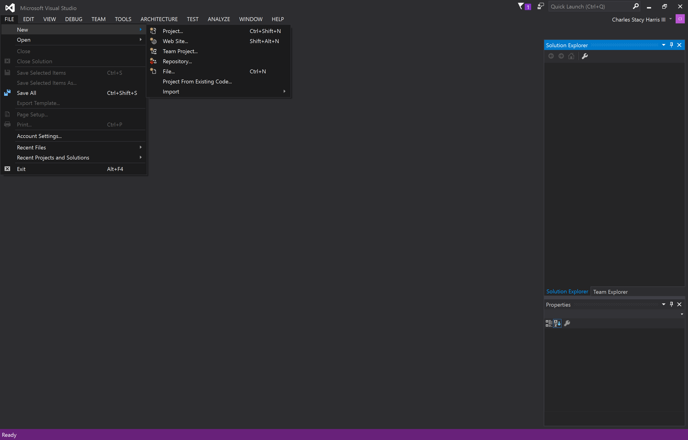
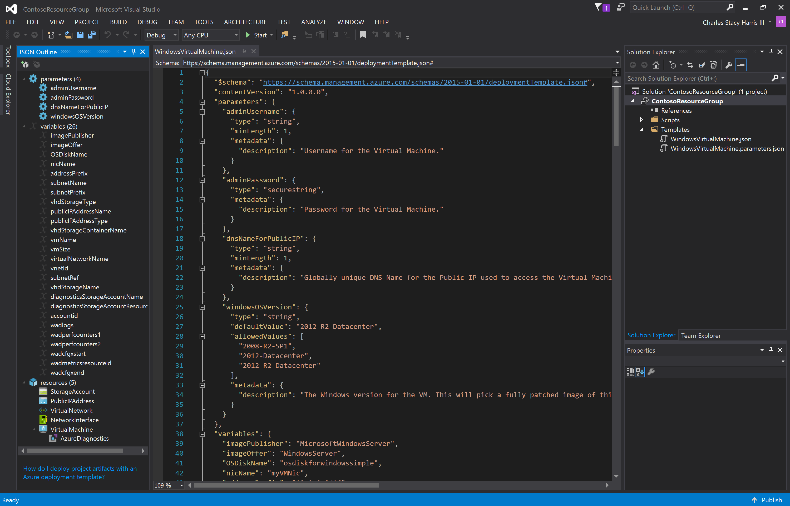

# Creating a Virtual Machine via an ARM Template

This lab will walk you through creating a VM in Azure using an Azure Resource Manager Template and Visual Studio. You will need to have the latest Azure SDK installed.

## 0. Start

* Open Visual Studio

* Click *File | New | Project*

* Under *Templates | Visual C#* click *Cloud*
* Select the *Azure Resource Group* template
* Give the project a name and location
* Click *OK* 

## 1.

## 2.

## 3.

* From the *Solution Explorer*, open *WindowsVirtualMachine.json* 
