Creating a Virtual Machine via the Azure Portal
-----------------------------------------------

This lab will walk you through creating a virtual machine in Azure by
using the web portal. For one-time usage, or for learning about new
features, this works well. For a repeatable process, you’ll want to
automate your deployments by using PowerShell and Azure Resource Manager
(ARM) Templates. For now, let’s log on to the Azure Portal as we did in
the first look section and create a virtual machine

1.  Click new …

Make sure that the *Deployment Mode* is set to *Resource Manager* then
click *Create*

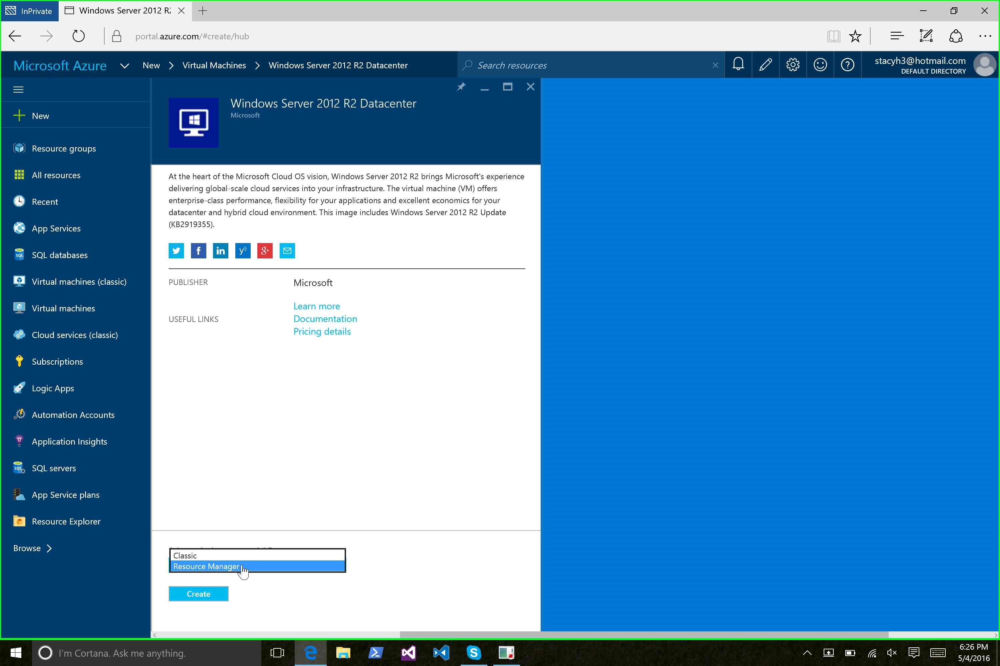

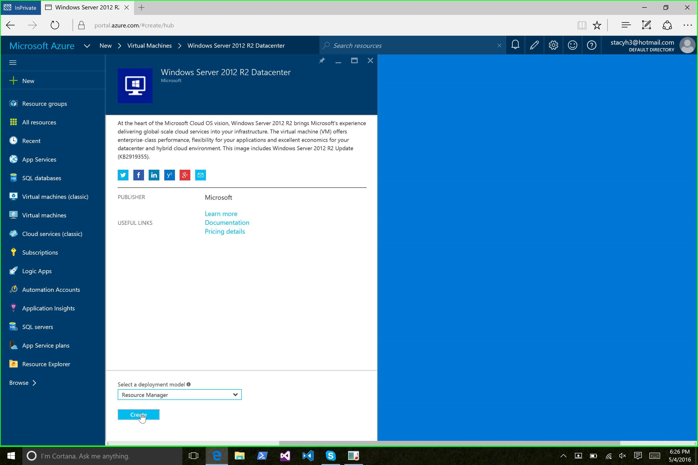

In the next series of steps, we’ll build up the VM and the other
environmental components that it needs. First, let’s supply some basic
information:

-   **Name:** The name of the Virtual Machine

-   **User Name:** The name for the administrative user account on the
    Virtual Machine

-   **Password:** The password for the administrative user account on the
    Virtual Machine

-   **Subscription:** If you have multiple Azure subscriptions, you can
    choose which subscription to use for this deployment

-   **Resource Group:** The name of the Resource Group into which the
    Virtual Machine will be deployed

-   **Location:** The data center where your resources will be deployed

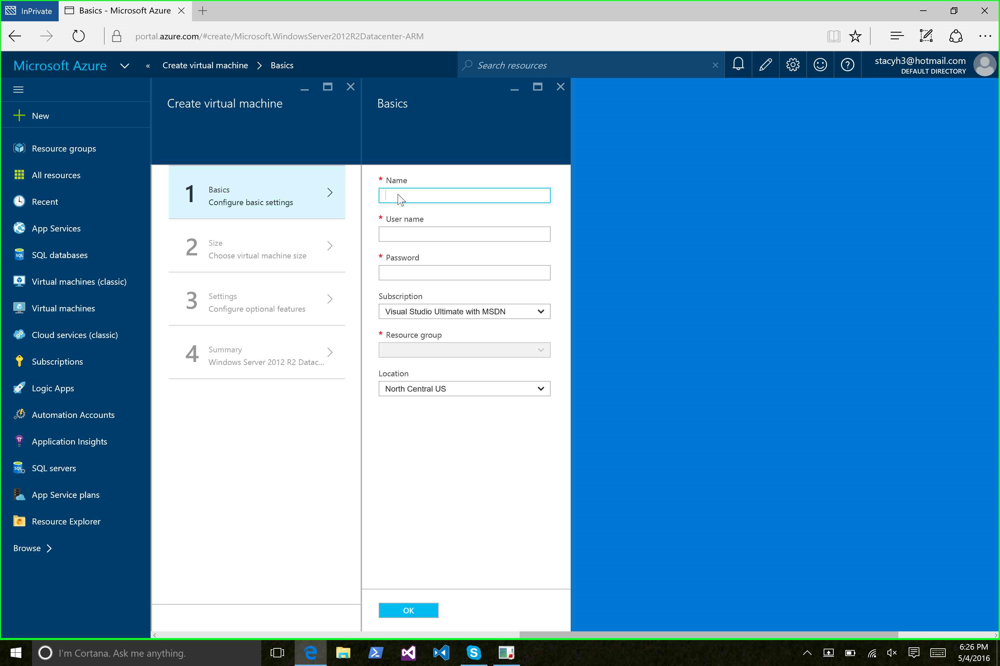
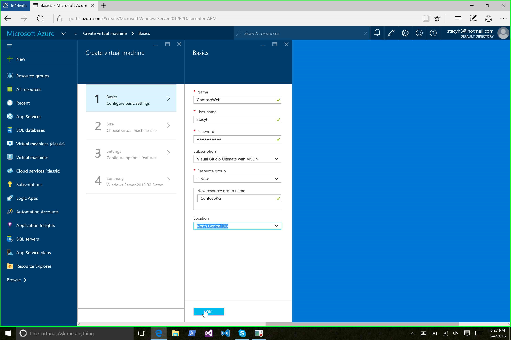
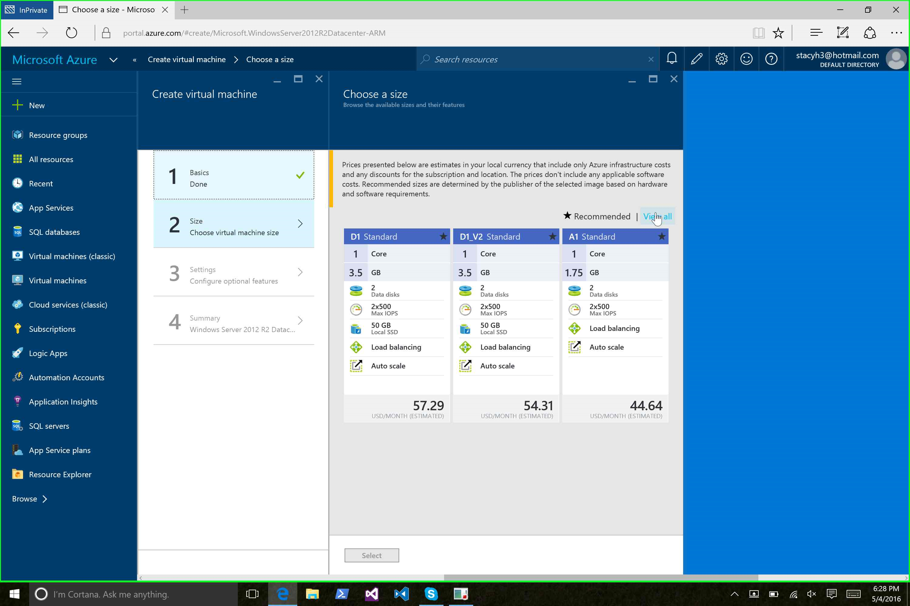
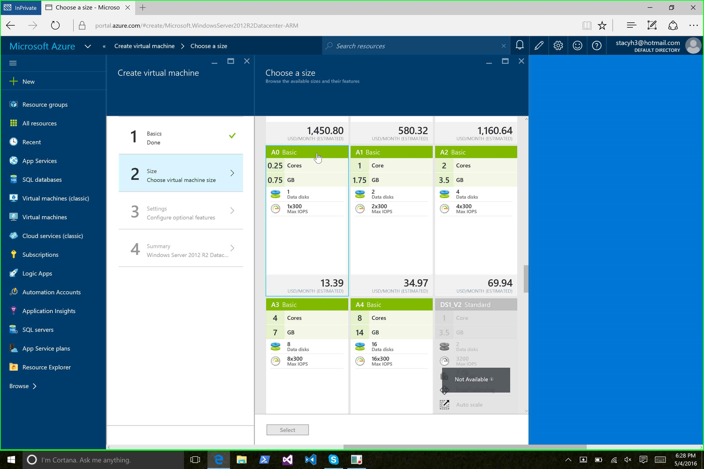
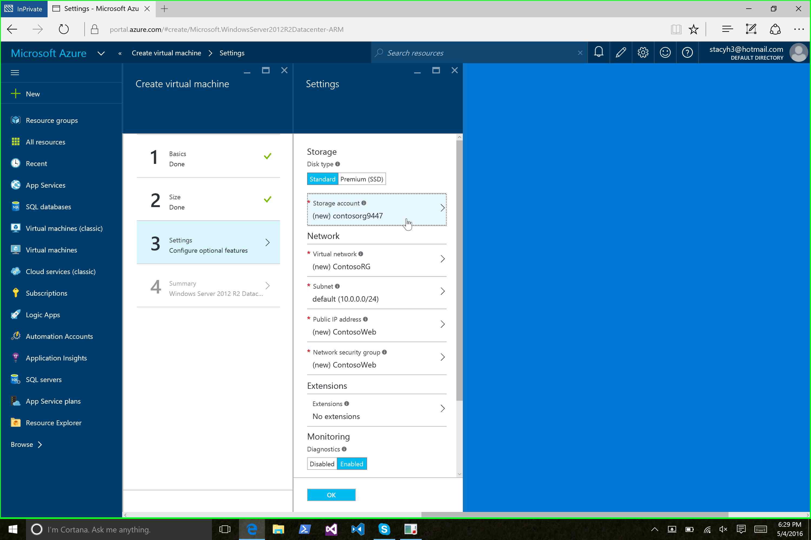
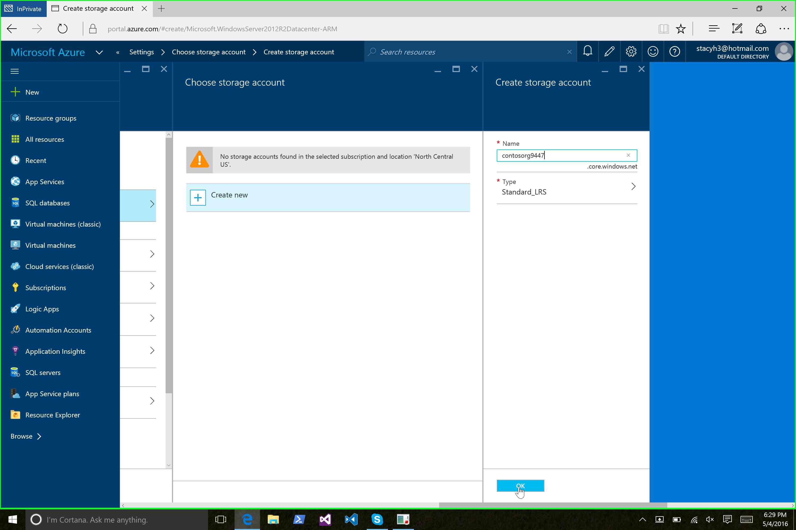
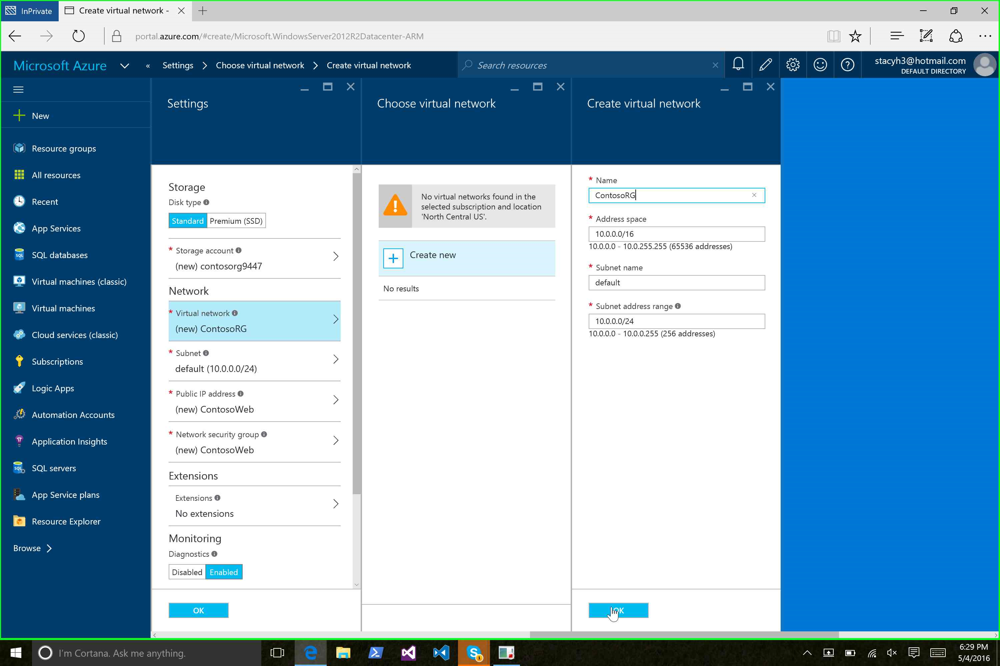

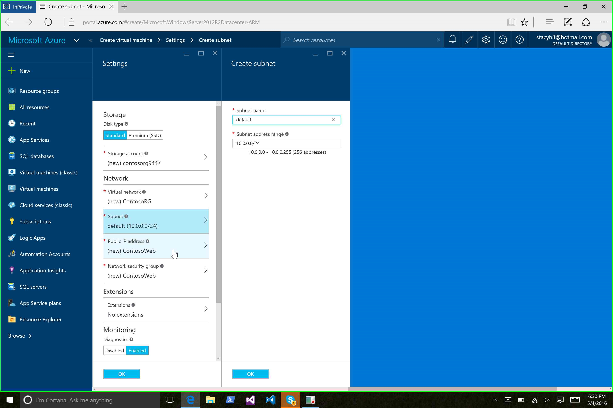
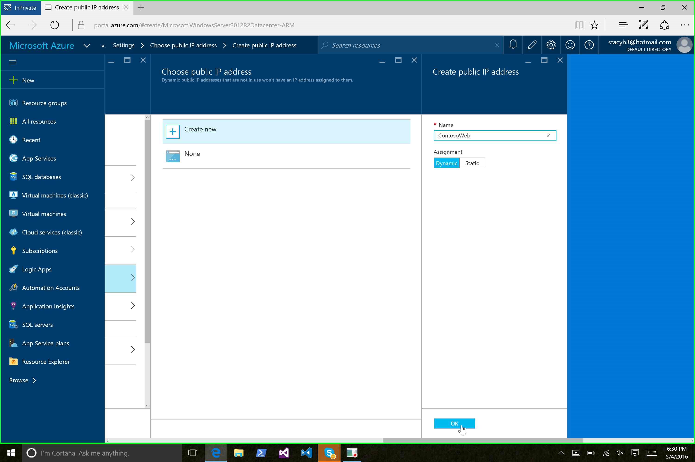
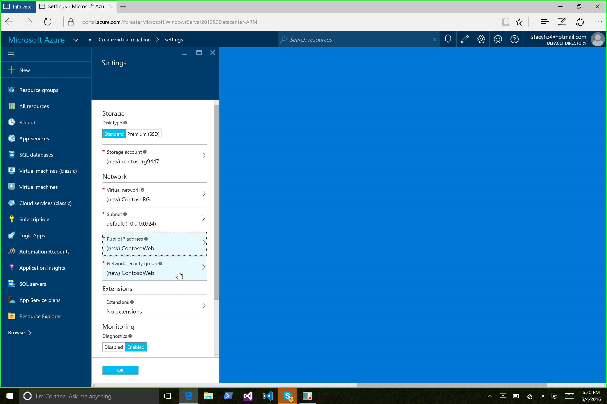
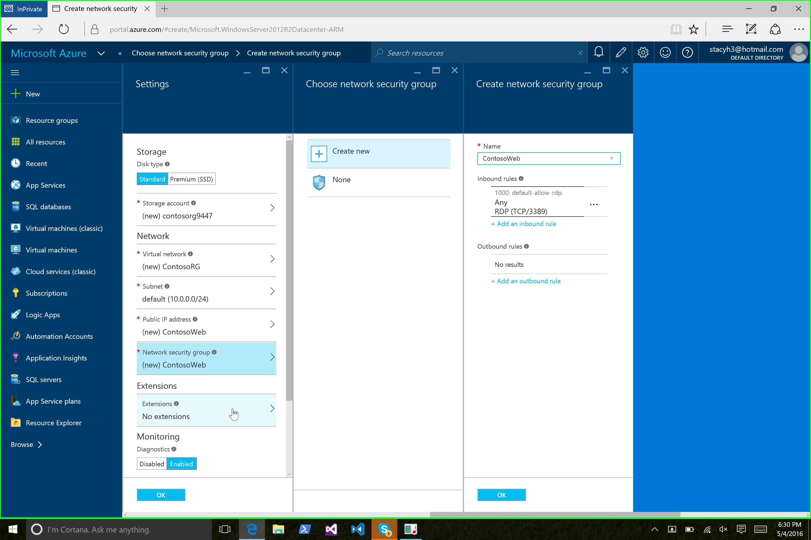
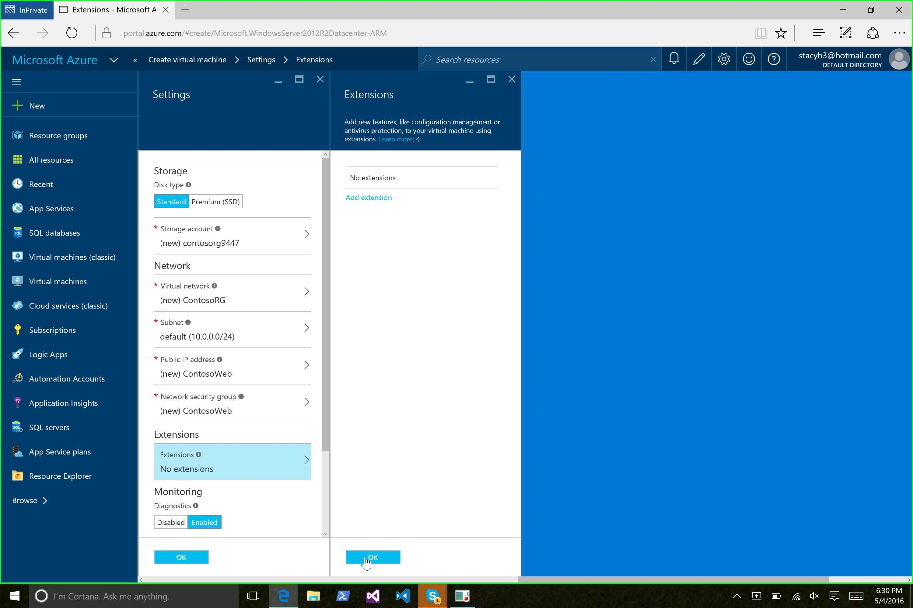

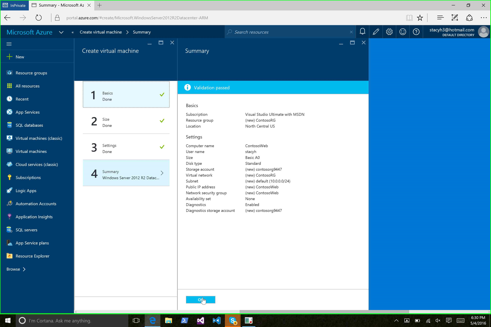
