# Creating a Virtual Machine via an ARM Template

This lab will walk you through creating a VM in Azure using an Azure Resource Manager Template and Visual Studio. You will need to have the latest Azure SDK installed.

## 0. Start

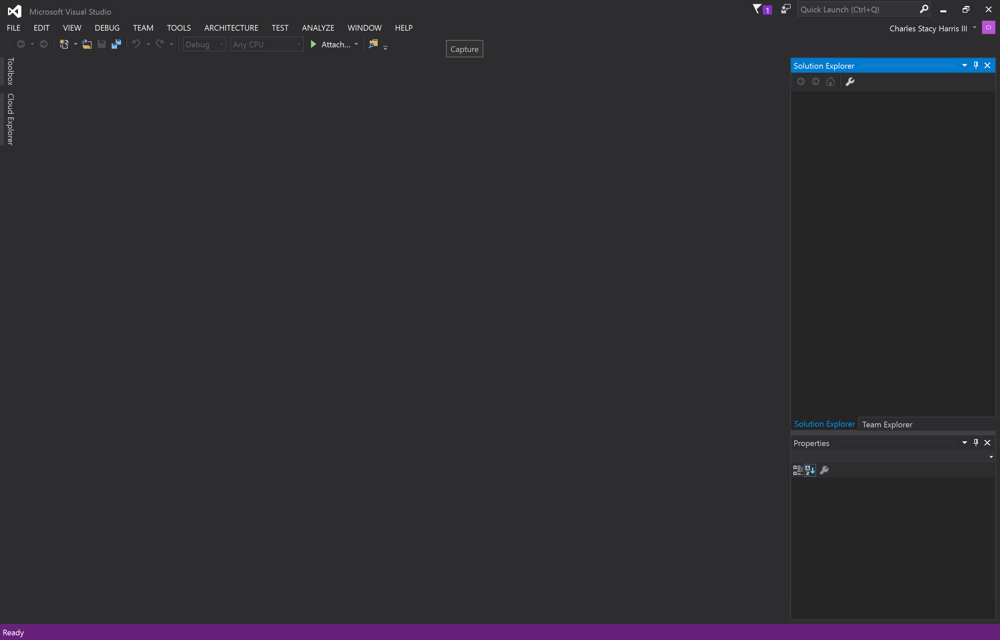
* Open Visual Studio

## 1. Create an Azure Resource Manager Project
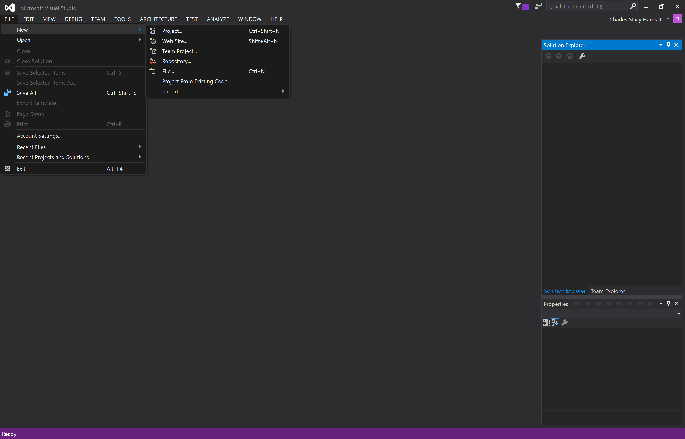
* Click *File | New | Project*

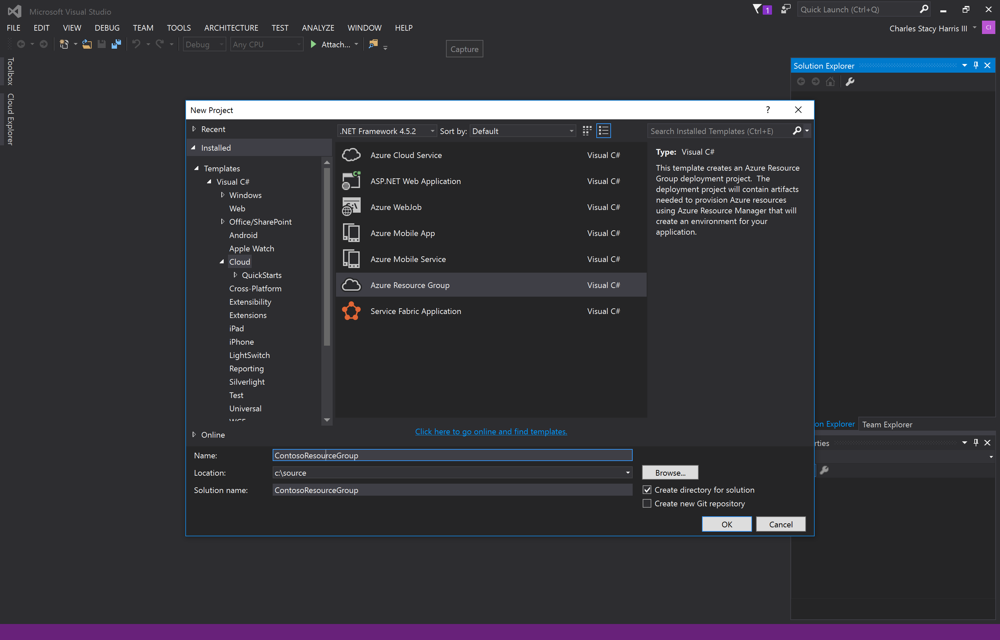
* Under *Templates | Visual C#* click *Cloud*
* Select the *Azure Resource Group* template
* Give the project a name and location
* Click *OK* 

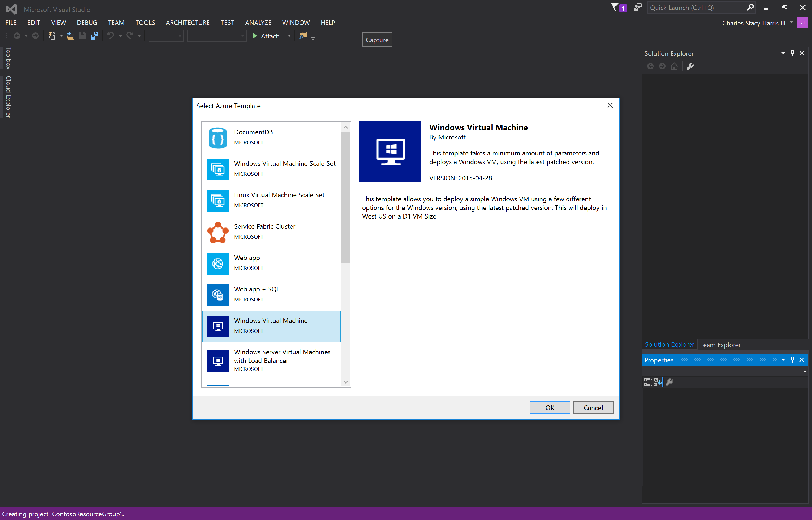
* In the *Select Azure Template* dialog box click *Windows Virtual Machine*
* Click *OK*

Visual Studio will create a project with an ARM template and a PowerShell script that is used to deploy the template.

## 2. Examine the ARM Template
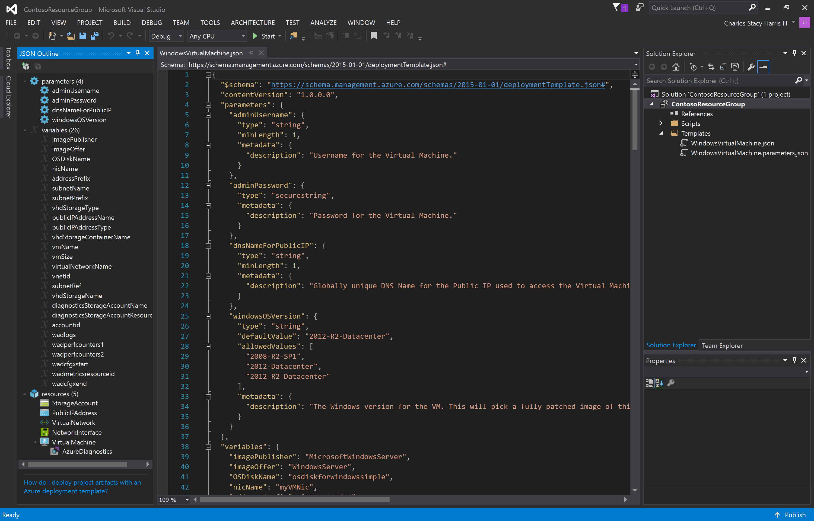
* From the *Solution Explorer*, open *WindowsVirtualMachine.json* 
* **Note:** Update coming. We'll add the DSC extension here in addition to leaving the AzureDiagostics resource

This is the ARM template. Resources and dependencies are added to this file. This instructs the Azure Resource Manager which resources to create and to order in which to create them based on dependencies.  

Note the JSON outline on the left. You can also use the outline to add new resources to the file. There are Azure resources that are not currently available via ARM templates. Also, there are some resources that __can__ be created by ARM templates, but the JSON schema does not reflect those. As with most things in the cloud, this changes pretty rapidly. By the time that you do this lab it's likely that coverage will have increased.

## 3. Deploy the ARM Template
Next we'll deploy the ARM template to a *Resource Group* in Azure.

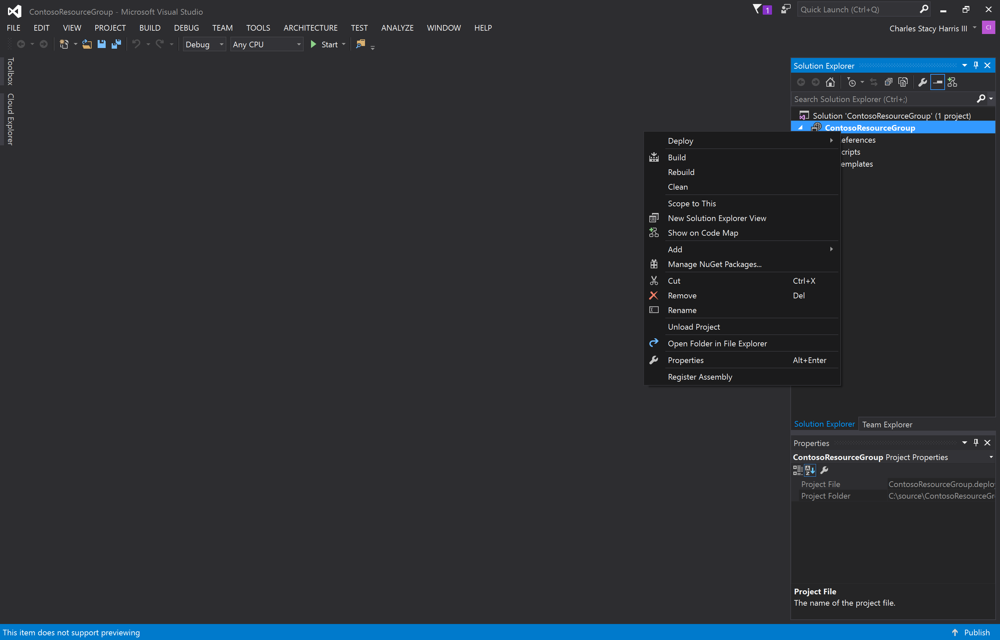
* Right click on the project in the Visual Studio solution explorer.
* Click *Deploy*

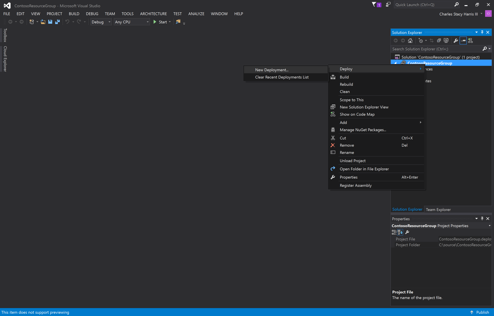
The first time you deploy the project, you'll choose *New Deployment*. After that, the deployment will show up in the  *recent deployments* list.
* Click *New Deployment*

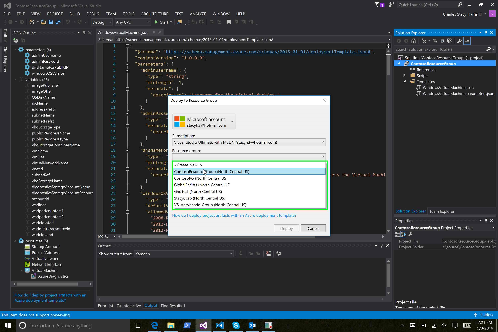
* Under the *Resource Group* dropdown, choose *Create New* to create a resource group into which we'll deploy the template.
* If you like, you can also choose an existing resource group.

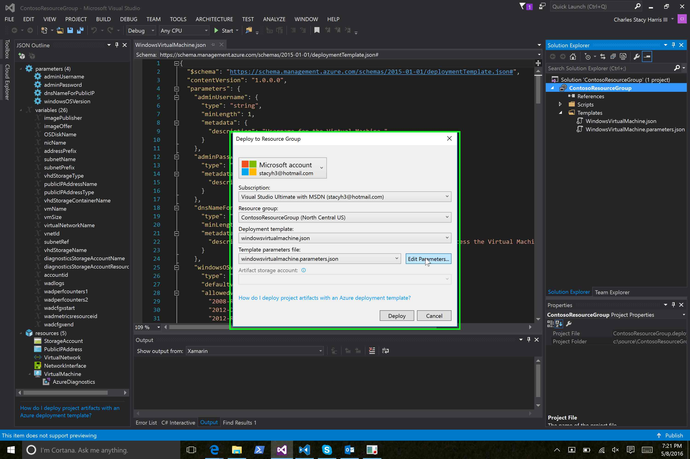
* Click *Edit Parameters*

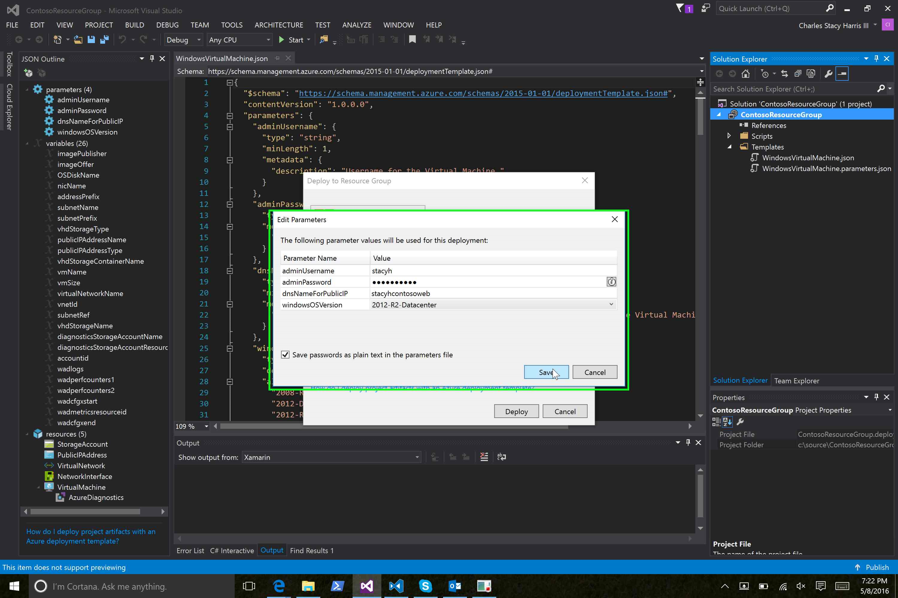
* Add paramter values for:
    * adminUsername
    * adminPassword
    * dnsNameForPublicIP **_Hint: Use lowercase letters!_**
    * windowsOSVersion
    * *Optional:* You can check the "Save passwords..." for **TESTING ONLY**. This is a really bad idea for production!
    
* Click *Save*
* Click *Deploy*

## 4. Waiting for Deploy
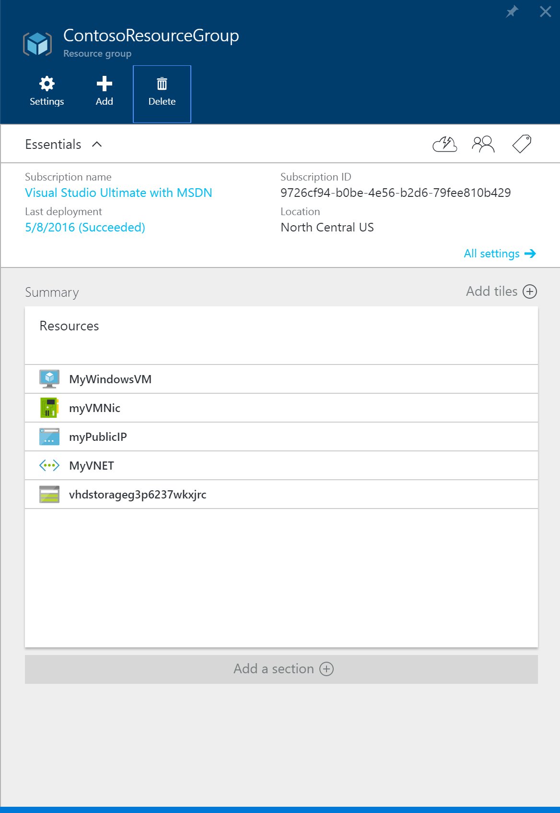

You can watch the Visual Studio Output window to see deployment messages. You can also see deployment progress on the Azure portal. When the deployment is complete, you should see a resource group similar to the above in the Azure portal.
