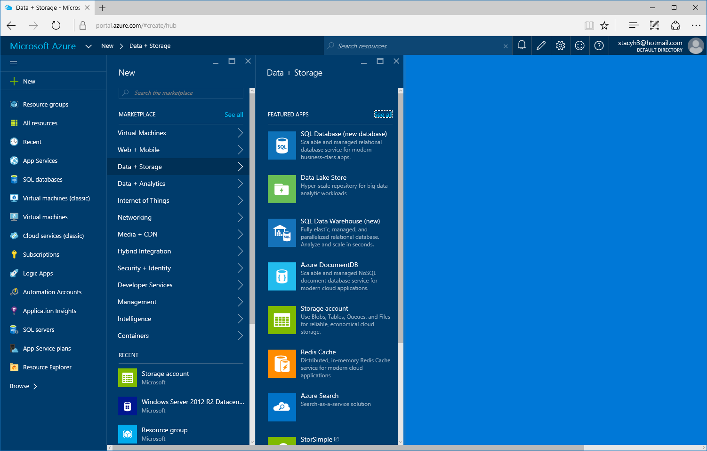
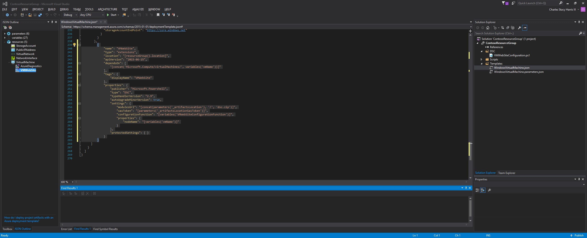

# Deploy a website to a VM using PowerShell DSC

## 1. Artifacts Reposiroty
The first thing we'll do is set up a storage account for use as an artifacts repository. This is a convenient location to deposit configuration files, etc. that we need during the next few steps.

* In the Azure Portal click *New*
* Click *Data + Storage*
* Click *Storage Account*

* Fill in values for the *Name, Resource Group, and Location*
* Click *Create*

## 2. 