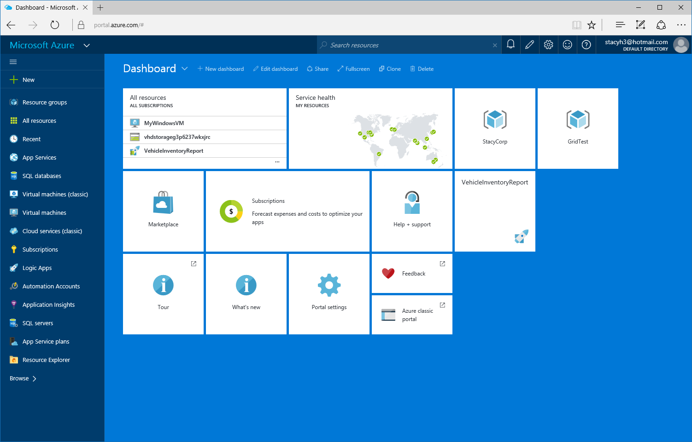
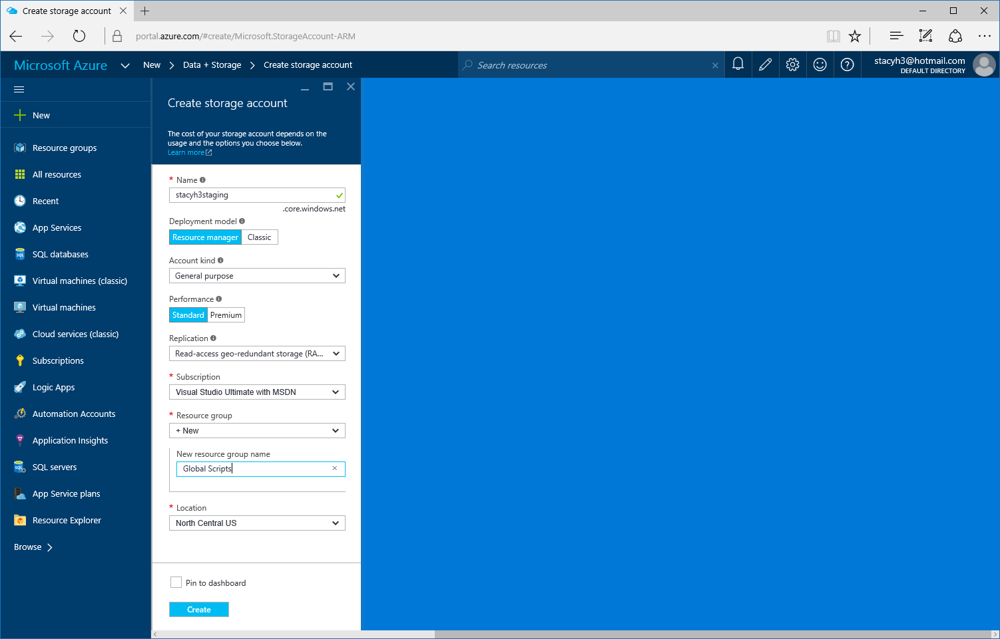

# Deploy a website to a VM using PowerShell DSC

## 1. Artifacts Reposiroty
The first thing we'll do is set up a storage account for use as an artifacts repository. This is a convenient location to deposit configuration files, etc. that we need during the next few steps.


* Open the Azure Portal


* Click *New*
* Click *Data + Storage*
* Click *Storage Account*


* Fill in values for the *Name, Resource Group, and Location*
* Click *Create*

## 2. Add a Website

* In Visual Studio click *File | Add | New Project*


* Choose *Web* and *ASP.NET Web Application*


* Select *MVC*
* Make sure that *Host in the cloud* is **not** selected
* Click *OK*


* Right click on *References* in your ARM template project. (Not the web project)
* Click *Add Reference*


* Check the box next to the web project.
* Click *OK*


* Click the new reference and make note of the *Include File Path* as shown. You'll need this later. 


* Open your *WindowsVirtualMachine.json* file.
* Make sure that the JSON outline is showing.
* Right click the JOSN outline and select *Add New Resource* 


* Select *PoerShell DSC Extension*
* Click *OK*


* Expand the *DSC* folder and open the *PS1* file.
* Uncommment the extensions that are listed in the file.

This file represents the configuration of the VM. It is a declarative file that the DSC agent can use to configure a system and to maintain system configuration over time.

* Add the following code to the configuration after the *StarWebDeploy* section.

````
Script DeployFile
{
     TestScript = {
        Test-Path "C:\WindowsAzure\package.zip"
    }
    SetScript ={
        $dest = "C:\WindowsAzure\package.zip"
        Invoke-WebRequest $Using:deployFilePath -OutFile $dest
    }
    GetScript = {@{Result = "DownloadWebPackage"}}
    DependsOn = "[Package]InstallWebDeploy"	
}

````

* Open the *WindowsVirtualMachine.json* file
* Place a comma after the last parameter declaration and add the following two new parameters:
````
"webApplication1PackageFolder": {
    "type": "string",
    "minLength": 1,
    "metadata": {
        "description": "WebDeploy package location. This path is relative to the _artifactsLocation parameter"
    }
},
"webApplication1PackageFileName": {
    "type": "string",
    "minLength": 1,
    "metadata": {
        "description": "Name of the webdeploy package"
    }
}
````

* Add URI - JSON

* Add URI - PS1

* Deploy
* Edit parameters
* Select the artifact storage file that you created in the first step